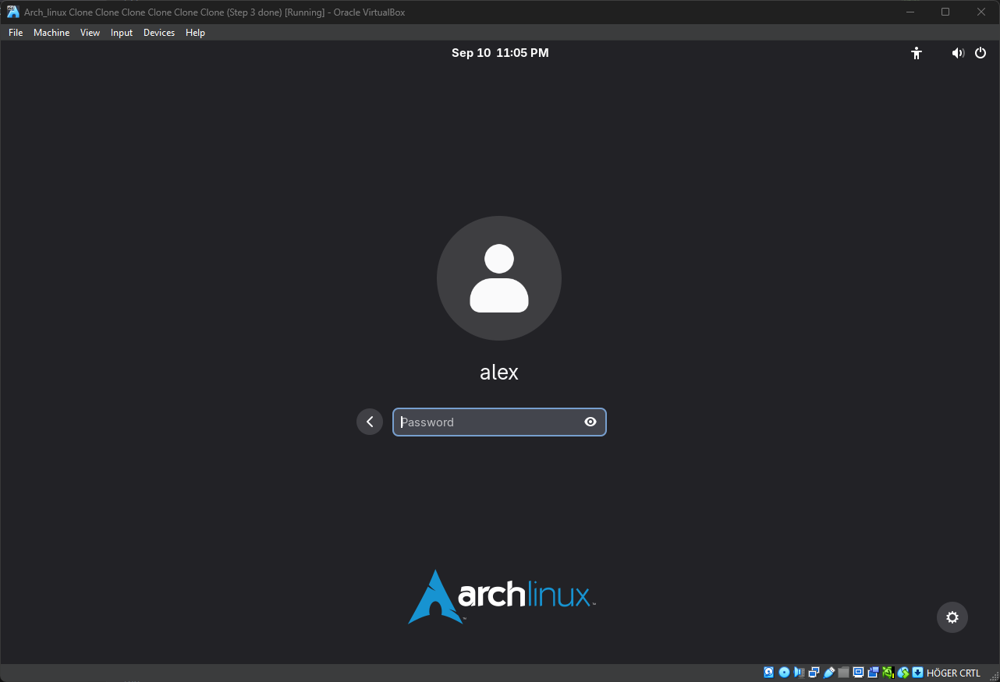

# Nackademin

### ​​Installing Arch Linux

Alexei Martinez Rodriguez  
DevOps 2024: Linux 2  
Kent Larsson
2025-09-11  

---

## Introduction
In the course, we were tasked with installing Arch Linux on a virtual machine without a graphical guide. The aim was to gain a deeper understanding of how a Linux system is built from scratch, as well as the security and performance considerations that are made during the installation.

## Prerequisites

* **Virtual machine:**
  * Firmware: UEFI
  * RAM: 8 GB
  * CPU: same type as host
  * Disks: two, 30 GB each (sda = system, sdb = storage)
  * Network: NAT or Bridged with DHCP

* **Software:**
  * Arch Linux ISO: [https://archlinux.org/download/](https://archlinux.org/download/)
  * Officiell installationsguide: [https://wiki.archlinux.org/title/Installation_guide](https://wiki.archlinux.org/title/Installation_guide)
  * VirtualBox: [https://www.virtualbox.org/wiki/Downloads](https://www.virtualbox.org/wiki/Downloads)
 

- **UEFI support**: Ensured that the system boots in UEFI mode instead of BIOS. 
- **Network**: Stable internet connection for downloading packages via `pacman`.  
- **Knowledge**: Basic understanding of Linux commands, file systems, and partitioning.
---
## Preparations
Before continuing with step 1, you should make some preparations.
**1.** You should have followed the installation guide up to step `1.8 Update the system clock` and updated the time.
**2.** You must check that the firmware is UEFI because otherwise this guide cannot be followed.

**Command:**
``` bash
[ -d /sys/firmware/efi ] && echo "UEFI mode OK" || echo "Not in UEFI"
```
**Expected result:**\
- `UEFI mode OK`


**(OBS):** If for some reason the link doesn't work, I'll leave you a summary of the code here so you can do it quickly.
```bash
localectl list-keymaps # to see all the list of lenguaje for the keybord
loadkeys sv-latin1 # select one, exemple sv-latin1 -> swedish
setfont ter-118b # big letter but not so big
ip link # see your internet config
ping ping.archlinux.org # see if you internet connection works
timedatectl # set the time and date 
```

---
## 1. Disk partitioning
With the `lsblk` or `fdisk -l`  command, you can see all the disks on your computer. This way, you'll know which disk to point to.

### Order
The order in which we are going to partition and format each disk will be as follows:
**1.** Change the partition table to GPT.
**2.** Create the corresponding partition for `/`, `/boot`, `/storage`.

**Command:**
**1.** Type the command `fdisk /dev/sda` to enter the hard drive.
**2.** Press the letter `g` to create a new GPT partition table. 
**3.** Press the letter `n` to create a new partition and follow the next exemple.


#### --- Partition /boot ---
``` bash
Partition number (1-128, default 1): #<- This means that you leave it blank
First sector (2048-1000215182, default 2048): #<- This means that you leave it blank
Last sector, +/-sectors or +/-size{K,M,G,T,P} (2048-1000215182, DEFAULT 1000214527): +1G # <- Here you can add the needed space exempel 1GB
```
- `/dev/sda1`: The space of this partition is 1G since it is where our system will boot.

- Now it's time to change the type of the `/dev/sda1` partition to UEFI system.

**Command:**
Press the letter `t` to add a type to a partition and follow the next exemple. 

``` bash
Selected partition 1
Partition type or alias (type L to list all): 1 #<- EFI System
```

- Press `w` to save all the changes before do anything else.

#### --- Partition / ---
``` bash
Partition number (1-128, default 1): #<- This means that you leave it blank
First sector (2048-1000215182, default 2048): #<- This means that you leave it blank
Last sector, +/-sectors or +/-size{K,M,G,T,P} (2048-1000215182, DEFAULT 1000214527): # <- we leave it empty to take all the space
```

- `/dev/sda2`: The space of this partition is the rest of the disk.
- Press `w` to save all the changes before do anything else.

#### --- Partition /storage ---
**Command:**
**1.** Type the command `fdisk /dev/sdb` to enter the hard drive.
**2.** Press the letter `g` to create a new GPT partition table. 
**3.** Press the letter `n` to create a new partition and follow the next exemple.

``` bash
Partition number (1-128, default 1): #<- This means that you leave it blank
First sector (2048-1000215182, default 2048): #<- This means that you leave it blank
Last sector, +/-sectors or +/-size{K,M,G,T,P} (2048-1000215182, DEFAULT 1000214527): # <- we leave it empty to take all the space
```
- `/dev/sdb1`: The space of this partition is the rest of the disk.
- Press `w` to save all the changes before do anything else.

**Control:**
Before continuing to the next section, make sure you type the following command and that the result is the same. It won't be 100% the same, but the important points should be the same.

``` bash
lsblk
```

**Expected result:**\
```bash
NAME        MAJ:MIN RM  SIZE RO TYPE  MOUNTPOINTS
sda           8:0    0   30G  0 disk  
├─sda1        8:1    0    1G  0 part  
└─sda2        8:2    0   29G  0 part  
sdb           8:16   0   30G  0 disk  
└─sdb1        8:17   0   30G  0 part  
```
---

## 2. Formatting and Mounting the partitions
Now we can proceed to the most important part, which would be formatting and mounting the disks correctly, since otherwise it will be very difficult for the system to boot.


### 2.1 / Partition
**1.** The cryptsetup luksFormat `/dev/sda2` command initializes and encrypts the `/dev/sda2` partition with LUKS.

**Command:**
``` bash
cryptsetup luksFormat /dev/sda2
```
**2.** We open the partition to allows the partition to be mapped to a logical device.

**Command:**
``` bash
cryptsetup open /dev/sda2 cryptroot
```
**3.** Then we format the encrypted partition as ext4, preparing it for use as the system's root file system.

**Command:**
``` bash
mkfs.ext4 /dev/mapper/cryptroot
```
**4.** Instead of mounting the disk, what we do is mount the encrypted mapping on the disk.

**Command:**
``` bash
mount /dev/mapper/cryptroot /mnt
```
- `cryptsetup`: Tool for managing LUKS-encrypted partitions.
- `luksFormat`: Initializes and encrypts a partition, creating the LUKS header.
- `/dev/sda2`: Second partition on the first disk where encryption will be applied.
- `cryptsetup open`: Unlocks the encrypted partition and maps it to /dev/mapper/.
- `mkfs.ext4`: Creates an ext4 file system within the unlocked partition.


### 2.2 /boot Partition
We are going to use the `/dev/sda1` partition as the boot partition for the system.

**Command:**
```bash
mkfs.fat -F32 /dev/sda1
mkdir -p /mnt/boot
mount /dev/sda1 /mnt/boot
```
- `mkfs.fat`: Create a FAT (File Allocation Table) file system
- `-F32`: Secifies FAT32, the modern version compatible with UEFI.
- `/dev/sda1`: Which partition you want to use.
- `mount`: Command that associates (mounts) a device or partition to a directory in the file system.
- `/mnt/boot`:  Path where you want to mounted. 


### 2.3 /storage Partition
This partition will be used as extra space for the computer.

**Command:**
``` bash
cryptsetup luksFormat /dev/sdb1
cryptsetup open /dev/sdb1 cryptstorage
mkfs.ext4 /dev/mapper/cryptstorage
mkdir /mnt/storage
mount /dev/mapper/cryptstorage /mnt/storage
```

**Control:**
```bash
lsblk
```

**Expected result:**\
```bash
NAME            MAJ:MIN RM  SIZE RO TYPE  MOUNTPOINTS
sda               x:x    0   30G  0 disk  
├─sda1            x:x    0    1G  0 part  /mnt/boot
└─sda2            x:x    0   29G  0 part  
  └─cryptroot     x:x    0   29G  0 crypt /mnt 
sdb               x:x    0   30G  0 disk  
└─sdb1            x:x    0   30G  0 part  
  └─cryptstorage  x:x    0   29G  0 crypt /mnt/storage
```

------------------------------------------------------------------------

## 3 Creating and Configuring Swapfile
In this section, a swap file is created within the root partition instead of a dedicated swap partition. This complies with the course instructions and allows the system to use virtual memory when RAM is insufficient.

**Command:**
``` bash
dd if=/dev/zero of=/mnt/swapfile bs=1M count=2048 status=progress
```
- `if=/dev/zero`: Uses the /dev/zero device as input, which generates infinite bytes 0x00.
- `of=/mnt/swapfile`: Output, the file to be created (in this case, the swapfile).
- `bs=1M`: Block size, here 1 megabyte.
- `count=2048`: Number of blocks to be written, in this case 2048 × 1 MB = 2 GB.
- `status=progress`: Shows the amount of writing done in real time.


**Control:**
``` bash
ls -l /mnt/swapfile
```

**Expected result:**\
```bash
-rw-r--r-- 1 root root 2.0G Mar  1 12:34 /mnt/swapfile
```

**1.** Secure permissions are assigned to the swap file so that only the root user can read or modify it, preventing unauthorized access to virtual memory.

**Command:**
``` bash
chmod 600 /mnt/swapfile
```
- `chmod`: Changes the permissions of a file.
- `600`: Grants read and write permissions only to the owner (root), and no permissions to other users.
- `/mnt/swapfile`: The previously created swap file.


**Control:**
``` bash
ls -l /mnt/swapfile
```

**Expected result:**\
```bash
-rw------- 1 root root 2147483648 Mar  1 12:34 /mnt/swapfile
```

**2.** The file is formatted as a swap area and immediately activated so that the system can use it as virtual memory.

**Command:**
``` bash
mkswap /mnt/swapfile
swapon /mnt/swapfile
```
- `mkswap`: program that creates an exchange area
- `swapon`: command that activates a device or file previously prepared as swap (with `mkswap`).
- `/mnt/swapfile`: path to the file you want to use as swap.


**Control:**
``` bash
swapon --show
```

**Expected result:**\
```bash
NAME             TYPE  SIZE   USED PRIO
/mnt/swapfile    file  2G     0B   -2
```

------------------------------------------------------------------------


## 4. Base installation
This section installs the core Arch Linux packages, including the base system, kernel, and essential tools, leaving the environment ready for additional configurations such as the bootloader, networking, and desktop.


**Command:**
``` bash
pacstrap -K /mnt base base-devel linux linux-firmware sof-firmware cryptsetup grub efibootmgr nano networkmanager sudo git
```
- `pacstrap`: Arch's tool for installing the base system to a target directory.
- `/mnt`: the mount point where the system will be installed (your new root).
- `base`: the minimal set of packages needed for a functional Arch Linux.
- `base-devel`: set of compilation tools (make, gcc, etc.) required for compiling programs.
- `linux`: Arch Linux standard kernel (latest stable release).
- `linux-firmware`: Contains the binary firmwares that the kernel needs for many modern hardware devices (Wi-Fi cards, GPUs, sound cards, etc.) to work properly.
- `sof-firmare`: Provides firmware for modern sound cards, improving audio compatibility and performance.
- `cryptsetup`: Utility for setting up and managing LUKS-encrypted partitions and volumes.
- `grub`: boot manager.
- `efibootmgr`: utilities for managing UEFI boot entries.
- `nano`: simple terminal text editor.
- `networkmanager`: Manages network connections (Ethernet, WiFi, VPN).
- `sudo`: Allows users to securely run commands with superuser privileges.
- `git`: Version control system for managing and tracking changes to code and files.


**Control:**\
- No errors should appear.

**Expected result:**\
- Package download and installation complete.

------------------------------------------------------------------------

## 5. System Configuration

In this section, the essential settings of the new system are applied, such as setting the timezone, localization, network, users, and bootloader, to make the installation complete and fully functional.

**Command:**
``` bash
genfstab -U /mnt > /mnt/etc/fstab
```
- `genfstab`: Generates entries for the fstab file based on the mounted file systems.
- `/mnt`: The directory where your new system is mounted.
- `> /mnt/etc/fstab`: Adds the generated entries to the fstab file within your new installation.

**Control:**
``` bash
cat /mnt/etc/fstab
```

**Expected result:**\
``` bash
# /dev/mapper/cryptroot
UUID=ZZZZ-ZZZZ  /           ext4   rw,relatime   0 1

# /dev/sda1
UUID=XXXX-YYYY  /boot       vfat   rw,relatime   0 2

# /dev/mapper/cryptstorage
UUID=XXXX-YYYY  /storage    ext4   defaults      0 0

# /swapfile     none        swap   defaults      0 0
```

------------------------------------------------------------------------

## 6. Setting Basic Configurations After Basic Installation
This section defines essential system settings, such as time zone, location, network configuration, and user creation, preparing the environment for proper operation after boot.


### 6.0 **Important**
**(OBS):** Use the command `arch-chroot /mnt` to enter the system, the promt change to `[root@archiso /]#`.

``` bash
arch-chroot /mnt
```

### 6.1 Create key file
In this step, a file with random data is generated that will serve as a key to automatically unlock the encrypted storage partition, avoiding having to manually enter the password every time you boot.
  

**1.** The first thing we need to do is create a secure keyfile that will be used to unlock the encrypted partition automatically at boot.

**Command:**
``` bash
dd if=/dev/urandom of=/etc/storagekey bs=1024 count=4
chmod 600 /etc/storagekey
chown root:root /etc/storagekey
```
- `if=/dev/urandom`: Uses the `/dev/urandom` device as input, which generates cryptographically secure random data.
- `of=/etc/storagekey`: Output file where the generated random key will be saved.
- `bs=1024`: Block size, here 1024 bytes (1 KB).
- `count=4`: Number of blocks to be written, in this case 4 × 1 KB = 4 KB total file size.


**2.** Next, add the keyfile to the LUKS encrypted partition, so the system can use it to unlock the disk without needing a password.

**Command:**
``` bash
cryptsetup luksAddKey /dev/sdb1 /etc/storagekey
```

**3.** Now we need to configure /etc/crypttab so the system knows how to unlock the encrypted storage device using the keyfile during boot.

**Command:**
``` bash
blkid -o value -s UUID /dev/sdb1 >> /etc/crypttab
nano /etc/crypttab
```

- Add this line to the file.

``` bash
cryptstorage  UUID=XXXXXXXX-XXXX-XXXX-XXXX-XXXXXXXXXXXX  /etc/storagekey  luks
```

**Control:**
``` bash
cat /etc/crypttab
```

**Expected result:**\
``` bash
cryptstorage  UUID=XXXXXXXX-XXXX-XXXX-XXXX-XXXXXXXXXXXX  /etc/storagekey  luks
```

**4.** Create /storage folder to ensure that the partition will be created in the right place.

``` bash
mkdir -p /storage
```

**Control:**
``` bash
cat /etc/fstab
```

**Expected result:**\
``` bash
UUID=XXXXXXXX-XXXX-XXXX-XXXX-XXXXXXXXXXXX   /storage   ext4   defaults   0  2
```


### 6.2 Timezone
``` bash
ln -sf /usr/share/zoneinfo/Europe/Stockholm /etc/localtime
hwclock --systohc
```
**Control:**
``` bash
date
```
**Expected result:**\
``` bash
Mon Jun 10 00:00:00 +04 2000 # <- this is fake data but has to seen like this format.
```

### 6.3 Locate Configuration
In this section, you enable and generate system locales to define the language, character encoding, and regional settings that Linux will use.

**1.** Configure languages.

**Command:**
``` bash
nano /etc/locale.gen 
```
- Uncomment the following content:
```bash
en-US.UTF-8 UTF-8
```
- Generate regional settings.
```bash
locale-gen
```
**2.** Configure system location.

**Command:**
``` bash
nano /etc/locale.conf
```
- Add the following content:
```bash
LANG=en_US.UTF-8
```
**3.** Configure the keyboard map and font.

**Command:**
``` bash
nano /etc/vconsole.conf
```
- Add the following content:
``` bash
KEYMAP=sv-latin1
```

**4.** Configure Hostname. 

**Command:**
``` bash
nano /etc/hostname
```
- Add the following content:
``` bash
alexArch
```

### 6.4 Password
In this step, you set the root user password, which is required to administer the system and run tasks with elevated privileges.

**Command:**
``` bash
passwd
```

### 6.5 User and User Password
After creating the root password we must create a user for ourselves.

**Command:**
``` bash
useradd -m -G wheel -s /bin/bash alex
passwd alex
```

- `useradd`: Creates a new user.
- `-m`: Automatically creates the home directory (/home/alex).
- `-G wheel`: Adds the secondary group wheel (typically used for sudo permissions).
- `-s /bin/bash`: defines the user's default shell, in this case Bash.
- `alex`: Username.

**(OBS):** If we don't put the username then it will change the root password.

### 6.6 Add User to sudo
Now you need to add the created user to the superuser privilege list so you can run the sudo command to install packages.
**1.** We enter the visual document.

**Command:**
``` bash
EDITOR=nano visudo
```
- Uncomment the following content:
``` bash
%wheel ALL=(ALL:ALL) ALL
```


------------------------------------------------------------------------

## 7. Configuring Locate, GRUB, etc...
In this section, you generate system locales, install and configure the GRUB boot loader for UEFI with encrypted root, and apply essential settings such as network, users, and microcode to get the system ready to boot and use.

### 7.1 Installing Microcode
to know which GPU you have, you can use the command `lspci`. Look for the line that starts with `VGA`. In this case we are going to pretend that we have an Intel GPU for practical purposes.

**1.** Identifiera din CPU
``` bash
lscpu | grep Vendor
```

**Expected result:**\
```bash
GenuineIntel → Intel CPU 
OR 
AuthenticAMD → AMD CPU
```

**2.** Installera rätt microcode-paket

**INTEL CPU**
``` bash
sudo pacman -S intel-ucode
```
**AMD CPU**
``` bash
sudo pacman -S amd-ucode
```

### 7.3 Installing Locate.
In this step, the `mlocate` package is installed to provide the `locate` command, which allows fast file searches by using a regularly updated database. This makes finding files across the system much quicker and more efficient compared to manual search commands like `find`.

**Command:**
```bash
sudo pacman -S plocate
systemctl enable plocate-updatedb.timer
sudo updatedb
locate fstab
systemctl status plocate-updatedb.timer
```
- `plocate`: plocate is the modern version of locate, used to quickly search for files.
- `sudo updatedb`: This builds the file index that locate uses to find files.

**Control**
```bash
locate fstab
systemctl status updatedb.timer
```

**Expected result:**\
```bash
/etc/fstab
/usr/share/man/man5/fstab.5.gz
```
------------------------------------------------------------------------
## 8 Bootloader and Encrypted Boot Configuration
In this section, the system is configured to boot securely from an encrypted root partition. It includes setting up the necessary hooks, rebuilding

### 8.1 Read encrypted root partition during boot.
This section configures the system to detect and unlock the LUKS-encrypted root partition during boot, ensuring secure access to the root file system before loading the rest of the operating system.

**Command:**
```bash
nano /etc/mkinitcpio.conf
```
- Find the HOOKS section inside the file and add the word `encrypt` between `block` and `filesystems`. This allow the system to boot from an encrypted partition.

**Expected result:**\
``` bash
HOOKS=(base udev autodetect microcode modconf kms keyboard keymap consolefont block encrypt filesystems fsck)
```

### 8.2 Rebuild initramfs
This part is importan because Without this part the system will not boot when you reset it.

```bash
mkinitcpio -P
```
- `mkinitcpio -P`: generates the initramfs image used by the kernel at boot time.


### 8.3 Installation of GRUB
This section installs the GRUB boot loader to the EFI partition, allowing the UEFI firmware to detect and load the operating system from the encrypted root partition.

**Command:**
``` bash
grub-install --efi-directory=/boot --bootloader-id=grub_uefi /dev/sda
```
- `grub-install`: Installs GRUB on the system as a boot loader.
- `--efi-directory=/boot`: Specifies the path where the EFI partition is mounted (in this case, /boot).
- `--bootloader-id=grub_uefi`: Name that will appear in the UEFI boot menu to identify GRUB.
- `/dev/sda`: Path of the disk you are installing grub.

**Control:**\
``` bash
ls /boot/
```

**Expected result:**\
``` bash
EFI grub initramfs-linux-fallback.img initramfs-linux.img vmlinuz-linux
```

### 8.4 Configuring GRUB
This step installs and configures the GRUB boot loader, which is essential for the system to load the kernel and, if applicable, unlock the encrypted root partition at startup. This ensures the computer can boot properly in UEFI mode and manage multiple operating systems if necessary.


**1.** Copy the encrypted device UUID into grub. Go to the end of the grub file and cut the UUIDs and paste them on the line that says  `GRUB_CMDLINE_LINUX_DEFAULT=`

**Command:**
``` bash
blkid -o value -s UUID /dev/sda2 >> /etc/default/grub
```
- Add the following content:
``` bash
cryptdevice=UUID=<uuid-of-sda2>:cryptroot
```


**2.** Do the same here but with `cryptroot`.

**Command:**
``` bash
blkid -o value -s UUID /dev/mapper/cryptroot >> /etc/default/grub
```

- Add the following content:
``` bash
root=UUID=<uuid-of-cryptroot>
```


**Expected result:**\
``` bash
="loglevel=3 quiet cryptdevice=UUID=<uuid-of-sda2>:cryptroot root=UUID=<uuid-of-cryptroot>"
```

### 8.5 Generate GRUB
Generate config file for the grub boot loader.

**Command:**
``` bash
grub-mkconfig -o /boot/grub/grub.cfg
```
- `grub-mkconfig`: automatically generates the GRUB configuration file.
- `-o /boot/grub/grub.cfg`: specifies the path to save the resulting file (grub.cfg), which is the one GRUB actually uses at boot time.
------------------------------------------------------------------------

## 9 Installing and Enabling Features before reboot


### 9.1 Installation Graphic Desktop
In this section, a complete graphical environment is installed, allowing the user to interact with the system through a modern and user-friendly interface instead of just the terminal. It involves installing Xorg, which provides the graphical foundation, and a desktop environment such as GNOME.

**Command:** 
``` bash
sudo pacman -S gnome gnome-tweaks gdm xorg-server xorg-xinit
```
- `gnome`: Installs the complete GNOME desktop environment, including all core applications.
- `gnome-tweaks`: Allows you to customize and tweak advanced GNOME settings.
- `gdm`:Provides a graphical login screen for managing users and sessions.
- `xorg-server`: This is the main graphical server that manages displays, input, and rendering.
- `xorg-xinit`: Allows you to start graphical sessions manually using the startx command.

- Enable the gaphic dekstop
``` bash
systemctl enable gdm
```

**Controll**
``` bash
systemctl status gdm
```

------------------------------------------------------------------------

## 10. Reboot
At this point we've finished the most important part, so all we need to do is reboot. Follow these steps.

1. Exit the  `[root@archiso /]` with the `exit` command.
2. `reboot`.

------------------------------------------------------------------------

# After the basic installation
**If you followed the steps correctly, you should see something like this:**



## 11. Installation of Zsh and Oh My Zsh
This section installs Zsh, an advanced and flexible command shell that replaces Bash, as well as Oh My Zsh, a framework that makes it easy to manage themes and plugins to improve the functionality and appearance of the terminal.

**Command:** 
``` bash
sudo pacman -S zsh
sh -c "$(curl -fsSL https://raw.githubusercontent.com/ohmyzsh/ohmyzsh/master/tools/install.sh)"
```

**Control**
``` bash
zsh --version
```

**Expected result:**\
```swift
Shell successfully changed to '/usr/bin/zsh'.
         __                                     __   
  ____  / /_     ____ ___  __  __   ____  _____/ /_  
 / __ \/ __ \   / __ `__ \/ / / /  /_  / / ___/ __ \
/ /_/ / / / /  / / / / / / /_/ /    / /_(__  ) / / /
\____/_/ /_/  /_/ /_/ /_/\__, /    /___/____/_/ /_/ 
                        /____/                      
                                                    ........is now installed!

Before you scream Oh My Zsh look over the `.zshrc` file to select plugins, themes, and options.

- Follow us on X: @ohmyzsh
- Join our Discord community: Discord server
- Get stickers, t-shirts, coffee mugs and more: Planet Argon Shop

➜  ~  
```

## 12. Installation of Starship
In this step, you install the Starship prompt to improve the appearance and usability of the terminal. Starship provides a fast, customizable, and informative command line prompt that works seamlessly with shells like Zsh, providing real-time context such as Git status, programming environments, and system information.

1. Install the package starship.
**Command:** 
``` bash
sudo pacman -S starship
```
- `pacman -S starship`: The command installs the **Starship** package, a modern, customizable terminal prompt for Arch Linux.

2. Change the config file of zsh to make starship boot from the beginin
**Command:**
``` bash
nano ~/.zshrc
```
- Add the following content after `source $ZSH/oh-my-zsh.sh`:
```bash
eval "$(starship init zsh)"
```
- `eval "$(starship init zsh)"`: The command initializes **Starship** within Zsh, activating your custom terminal prompt.

3. rebuild the file to apply the changes.
```bash
source ~/.zshrc
```
- `source ~/.zshrc`: The command reloads the Zsh configuration to immediately apply changes made to the `~/.zshrc` file.


**Control**
If this works and you see the new prompt, the problem is how it is written in your ~/.zshrc.


**Expected result:**\
``` bash
~
>  
```

## 13. i3 Installation
In this step, you install the Xorg display server, which provides the graphical foundation needed to run desktop environments like GNOME or install window managers like i3. It manages input devices, display outputs, and rendering, allowing the system to display graphical interfaces and user interactions.

**Command:** 
``` bash
sudo pacman -S i3-wm i3status dmenu xterm polybar
```
- `i3`: The main window manager that will manage how windows are arranged.
- `dmenu`:  A lightweight menu opened with Mod + d (by default, Mod = Windows key). This allows you to quickly run programs by simply typing their names.
- `xterm`: A basic terminal. This ensures you have at least a functional terminal to test i3.
- `polybar`: Polybar will replace the basic i3 bar (i3status), allowing you more customization.

### 13.1 Configure i3 to use Polybar

**Command:**
``` bash
mkdir -p ~/.config/i3
nano ~/.config/i3/config
```
- Add the following content at the end:
``` bash
exec_always --no-startup-id polybar example
```

**Control**
``` bash
Don't close GNOME yet, just log out and in the login manager (GDM) select i3 instead of GNOME.
Select: Win/Super
```

**(OBS)**: The commands and controls are going to change so I recommend you go to the i3 guide to navigate through the interface. [i3 guide](https://i3wm.org/docs/userguide.html).


## 14. Configuration of Backup
In this step, you configure a backup system to automatically create and manage secure copies of important data using Restic and a systemd timer. This ensures reliable data recovery in the event of a system failure, accidental deletion, or corruption, while also providing version control and encryption for added security.

**Command:** 
``` bash
sudo pacman -S restic
sudo restic init --repo storage/backup
sudo restic -r /storage/backup backup /home/alex
```
- `restic`: Restic is a fast, secure, console-based backup tool that encrypts and deduplicates data to create and restore local or remote snapshots.
- `--repo storage/backup`: Specifies the path to the Restic repository; without a leading `/` it is a **relative path** to the current directory—use `/storage/backup` for an absolute path.
- `-r /storage/backup`: Specifies the **Restic repository**; using an absolute path avoids accidentally creating the repository in a relative location.
- `backup`: Subcommand that **creates a snapshot** of the specified directories.
- `/home/alex`: **Source folder** whose data will be included in the backup.


### 14.1 Automate with systemd timer
This step configures a **systemd timer** to automatically run scheduled Restic backups at specific intervals. It ensures that backups are created consistently without manual intervention, providing a reliable and automated data protection process.

**Command:**
``` bash
nano /etc/systemd/system/restic-backup.service
```

- Add this line to the file.

``` bash
[Unit]
Description=Restic Backup Service

[Service]
Type=oneshot
ExecStart=/usr/bin/restic -r /storage/backup backup /home/alex
```

### 14.2 Create timer file
Create the systemd `.timer` unit that schedules automatic backup execution. Define the schedule with `OnCalendar`, set `Persistent=true`, and reference `Unit=restic-backup.service`.

**Command:**
``` bash
sudo nano /etc/systemd/system/restic-backup.timer
```

- Add this line to the file.
``` bash
[Unit]
Description=Run restic backup daily

[Timer]
OnCalendar=03:00
Persistent=true

[Install]
WantedBy=timers.target
```

### 14.3 Activate
Enable and start the systemd `.timer` so that the backup is scheduled and starts counting from now on. After `systemctl enable --now restic-backup.timer`, verify with `systemctl list-timers | grep restic`.

**Command:**
``` bash
sudo systemctl enable --now restic-backup.timer
```

**Control**
``` bash
systemctl list-timers | grep restic
```

**Expected result:**\
``` bash
Thu 2025-09-11 01:00:00 CEST     1h 16min -
- restic-backup.timer            restic-backup.service    
```
### 14.4 Restore Snapshot
**Command:**
``` bash
restic -r /storage/backup snapshots
```
**Expected result:**\
``` bash
ID        Date                Host        Tags        Paths
----------------------------------------------------------------------
a1b2c3d4  2025-09-10 03:00    your-host                /home/alex
d5e6f7g8  2025-09-11 03:00    your-host                /home/alex  
```
**Command:**
``` bash
restic -r /storage/backup restore a1b2c3d4 --target /home/alex-restore
```
